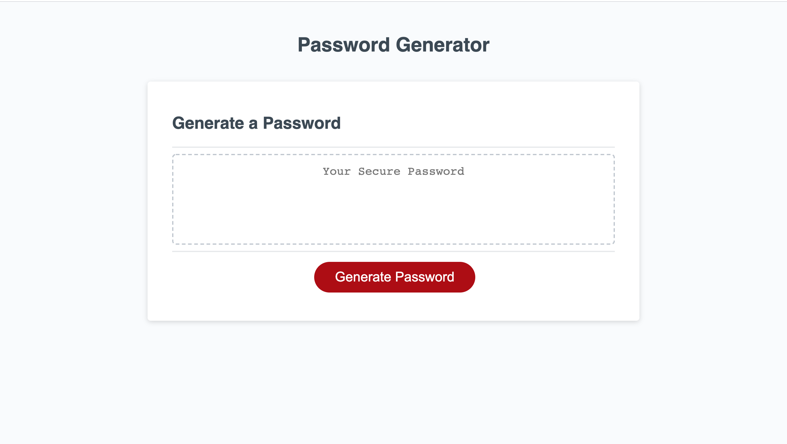

# PasswordGenerator

# **License:**
  ### MIT
  

  # **Table of Contents**

  *[Description](#description)

  *[Installation](#installation)

  *[Usage](#usage)

  *[Guidelines](#guidelines)

  
  # **Description**
  ### I refactored this code so that it would generate a passwork that was between 8 to 128 characters long and included upper case, lower case, numbers, and       special characters.
   
  
  
  # **Usage**
  ### This app runs in the browser and features dynamically updated HTML and CSS powered by JavaScript.
  
   
  # **Links:**
  ### (https://avmancillas.github.io/Week3HW/)
 
  
  

